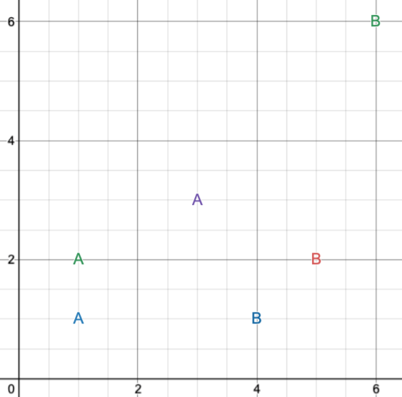
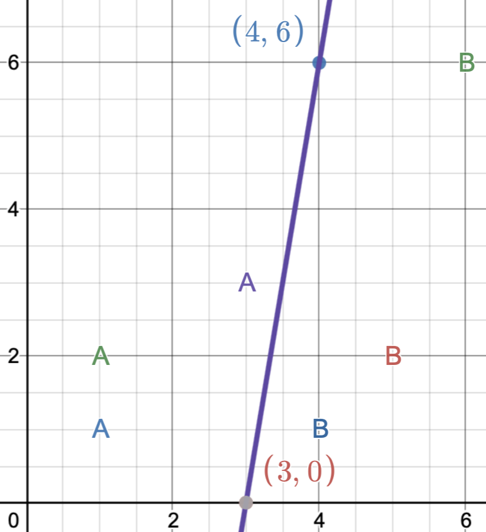
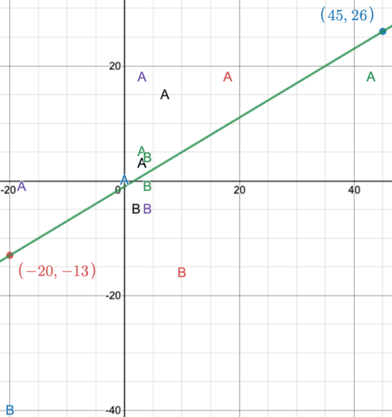
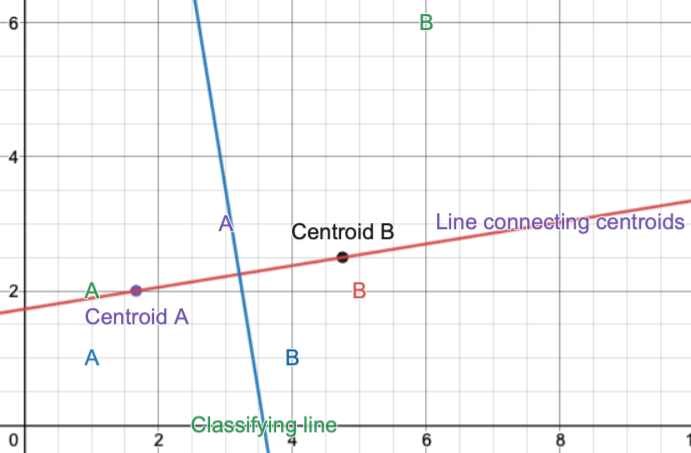
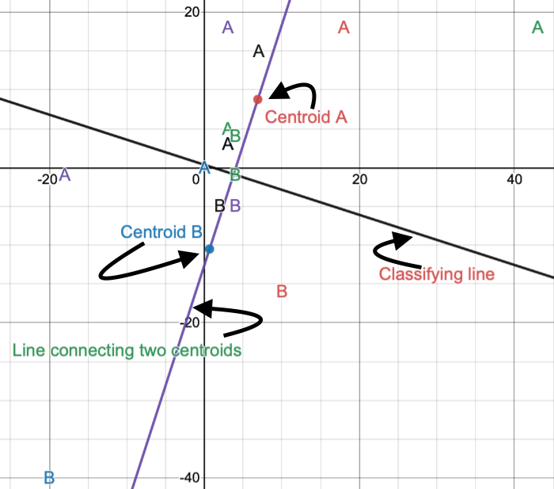

# Linear Categorisers

## Scenario

Make a linear classifer that separates the A's and the B's from the two scenarios below.
- Line Class 1

- Line Class 2

## Approach 1: Hard-coded linear classifier

Equation of a line is made using 2 hard-coded points. Below is the result of hard-coding two points to determine the best linear classifer.

Below is the result of this method for both Line Class 1 and Line Class 2. The labelled points (i.e. (4, 6) ) is a hard-coded point used to create the linear classifier.

- Line Class 1

- Line Class 2
 

## Approach 2: Centroid
A learning line approach.
1. The point at the centre of class A points and the point at the centre of class B points are the **centroids**.

2. A line is made connecting the two centroids.

3. A perpendicular line intersects the line connecting the two centroid. This line intersects at exactly the midpoint of the two centroids. 

4. The perpendicular line classifies A and B points.

This approach does not always produce optimal results. Be that as it may, this approach is sufficiently accurate for this dataset.

Below is the result of this method for both Line Class 1 and Line Class 2.

- Line Class 1

- Line Class 2
 
