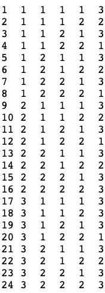
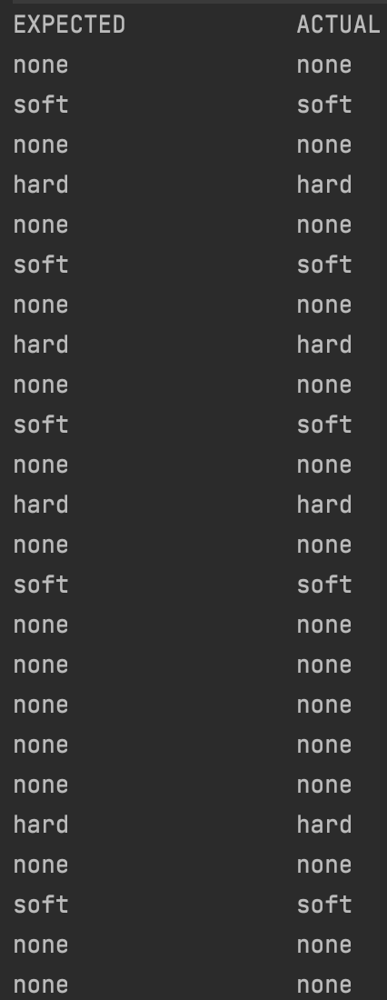
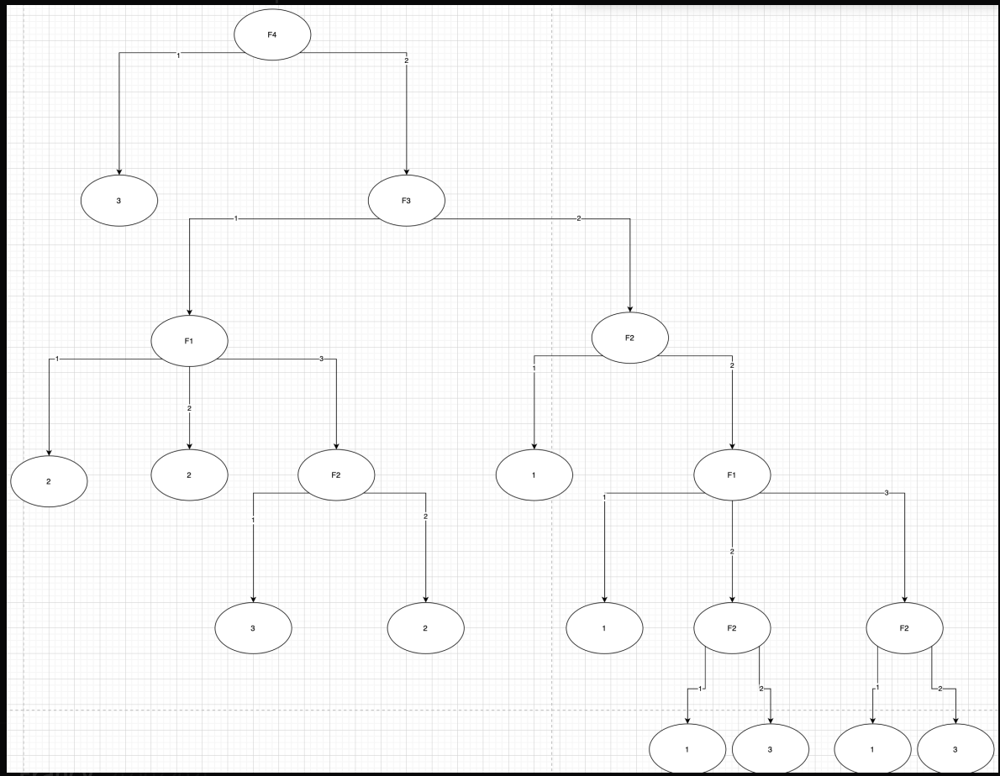
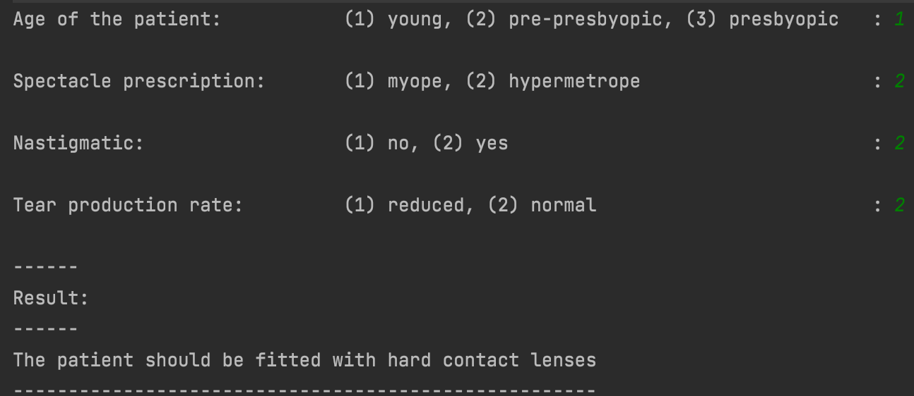

# Categorisation with Decision Trees

## Scenario
 
A hospital is in need of an automated system that correctly categorises a patient with a lens type for their eyes. The categorisation is dependent on their condition (i.e. their age). 

 Below is the lenses data to train and make the decision tree learn. After the tree learns this data, the program will be able to provide any patient (with any given set of conditions) with a lens.

  

  i.e. dataSet '5  1  2  1  1  3'.
- '5' is the dataSet's number.
- The next four numbers '1  2  1  1' are the feature's inputs. Features are the decisions to be made, these are also known as the conditions of the patient.
- The last number '3' is the category of the dataSet (also known as the result (or class the 4 inputs belong to altogether).

**Table 1 elucidates the example of dataSet number 5 (mentioned above)**

**Table 1**
| Feature        | Meaning |                        Attribute information                 | Row 5 |
| -------------  |:-------:|:-----------------------------------------------------------: | -----:|
| Feature 1      | age of the patient:    | (1) young, (2) pre-presbyopic, (3) presbyopic |   1   |
| Feature 2      | spectacle prescription:|  (1) myope, (2) hypermetrope                  |   2   |
| Feature 3      | astigmatic:            |(1) no, (2) yes                                |   1   |
| Feature 4      | tear production rate:  |  (1) reduced, (2) normal                      |   1   |
| Class          | contact lens type:     |  1 : the patient should be fitted with hard contact lenses 2 : the patient should be fitted with soft contact lenses 3 : the patient should not be fitted with contact lenses.                      |   3   |

_This data is from the UCI benchmark, and here is the [description](https://archive.ics.uci.edu/ml/datasets/lenses "Lense Data Description") if you're interested._

## Approach 1: Control Flow Tree

Below is the result of this approach, the ouput is the lens type required for the patient. The image below demonstrates a test to see if the actual results match the expected results.

## Approach 2: Hard-coded Decision Tree

1. Branches of the tree denote the outcome of the decisions/features.
2. The branches are hard-coded. This is a quicker method of finding the lens required for a patient since it breaks down the decisions and results into a tree data structure. This method can be carried over to the next approach, the C45 algorithm.
3. Below is a diagram of the hard-coded decision tree.
4. In the diagram below, 'F' represents a feature and '1','2','3' represent the class/result of the decisions made by the patient.
5. For instance, the very top branch (the root) contains 'F4', this means Feature 4. If the user decided they had a 'reduced tear production rate' (which is attribute '1'), then 'the patient should not be fitted with contact lenses', this is the left branch from 'F4' (which is '3'). Refer to 'Table 1' for details. 

This approach is sufficiently accurate for this dataset.
Below is the console interaction and output for this program:

